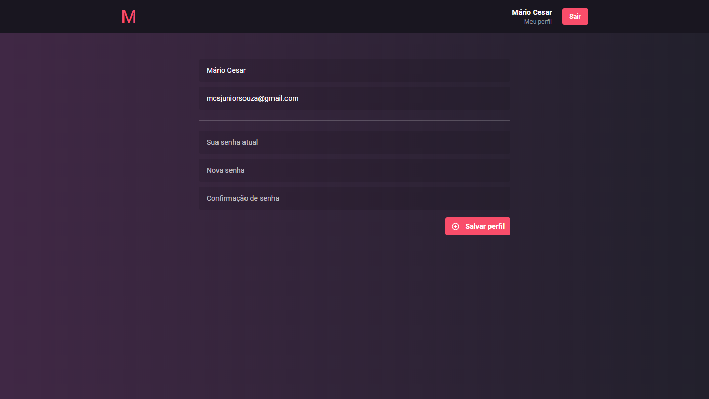

# Desafio Bootcamp Rocketseat

## Aplicação

App agregador de eventos para desenvolvedores chamado Meetapp (um acrônimo à Meetup + App).

## Funcionalidades

### Autenticação

- Utilizando e-mail e senha.
- Validação dos dados de entrada.

### Cadastro e atualização de usuários

- Permite que novos usuários se cadastrem com nome, e-mail e senha
- Criptografia de senha do usuário para segurança.
- Atualização de senha com confirmação de campo com a mesma.
- Validação dos dados de entrada.

### Gerenciamento de meetups

- Cadastro de meetups com título, descrição, localização, data, hora e imagem(banner).
- Edição de todos os dados de meetups que ainda não aconteceram em que o usuário é o organizador.
- lista de meetups que são organizados pelo usuário logado.
- Cancelamento de meetups organizados pelo usuário que ainda não aconteceram.
- Validação dos dados de entrada.

### Inscrição no meetup

- Inscrição em meetups que o usuário não organiza.
- Envio de e-mail para o organizador contendo os dados relacionados ao usuário inscrito.
- Validação dos dados de entrada.

### Listagem de meetups

- lista de meetups com filtro por data.

## Frontend

## Mobile

